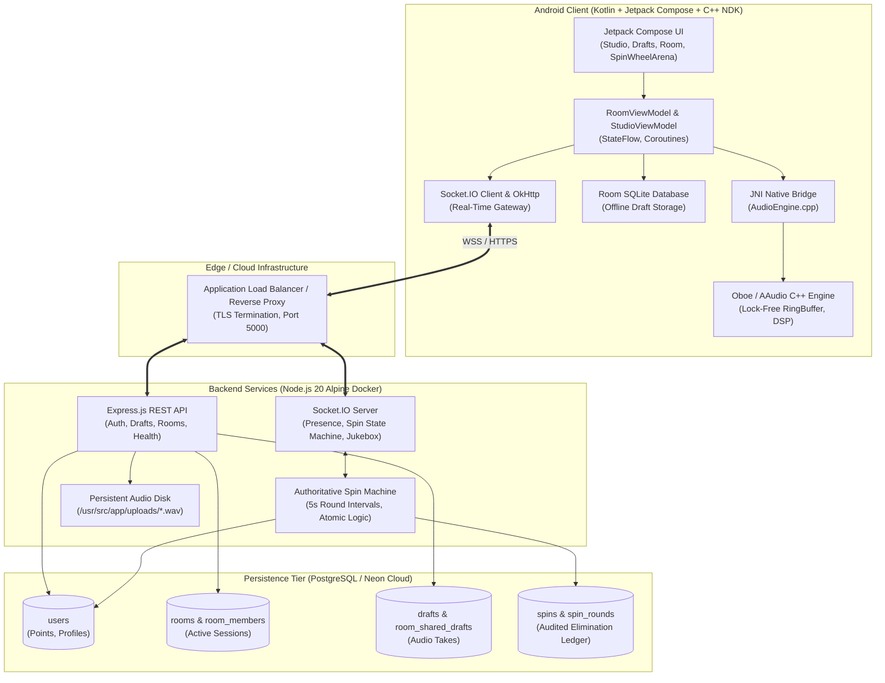
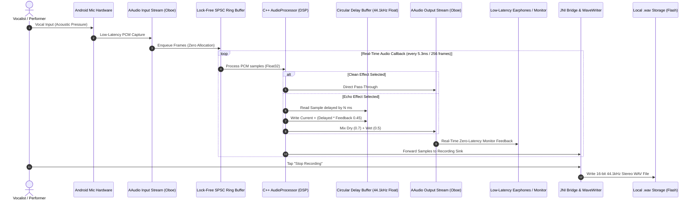
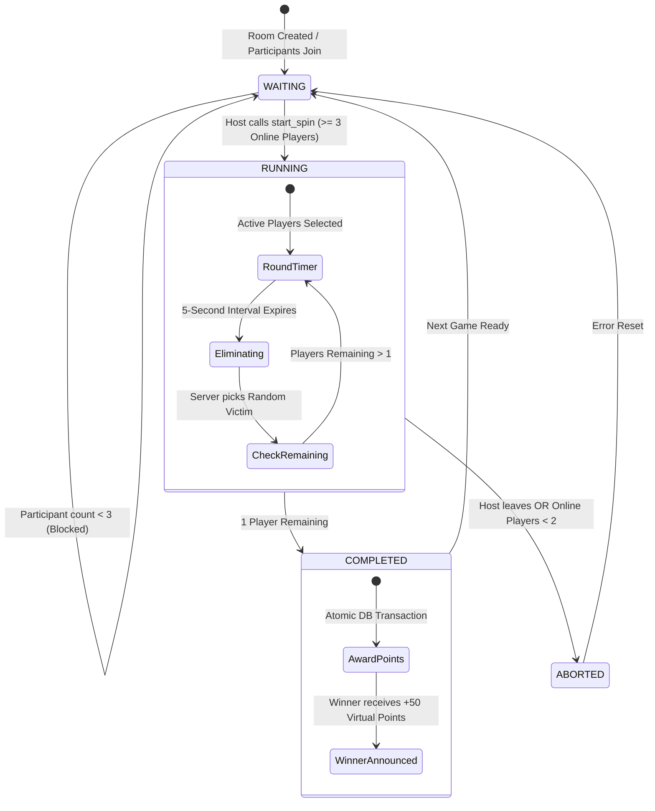
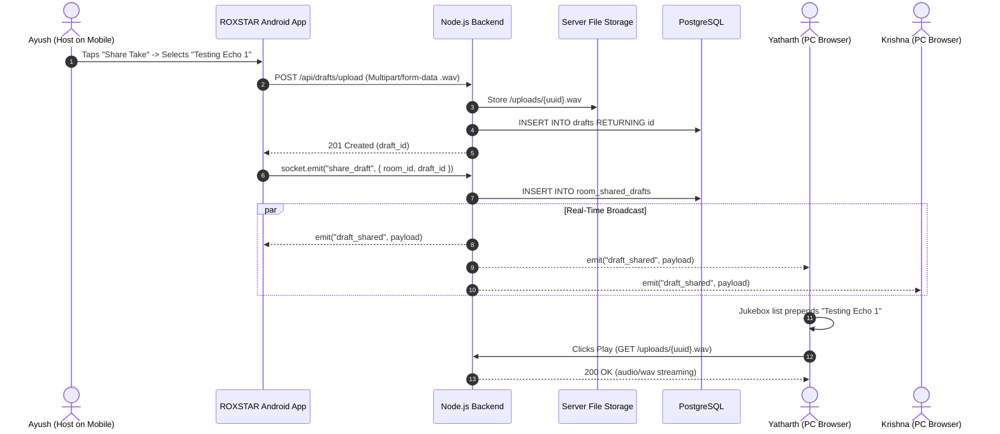

# ROXSTAR System Architecture & Engineering Diagrams

Comprehensive technical architecture, audio pipeline specifications, and WebSocket protocol diagrams for the **ROXSTAR Audio Engine & Multiplayer Elimination Platform**.

---

## 1. High-Level System Architecture

---

## 2. Low-Latency Native Audio Processing Pipeline (Section A)

---

## 3. Real-Time Multiplayer Spin Wheel State Machine (Section C)

---

## 4. In-Room Jukebox Take Sharing Sequence Diagram

